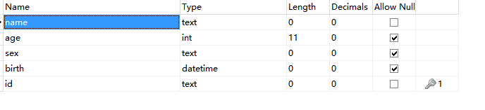

# express-mysql-jade
node,express+mysql+jade实现简单增删改查功能

## 步骤
- [基于Express 应用生成器，生成项目express-mysql-jade](http://www.expressjs.com.cn/starter/generator.html)
- 安装本地数据库，创建数据库demo及表person

## 表结构

## 增、删、改、查效果

## 其他

- 热启动-组件supervisor，不用每次修改代码后都重启服务，该组件检测代码变化然后自动重启
==

  npm install -g supervisor
  
  supervisor [要执行的脚本]  //用supervisor启动服务
  

- [jade模板](http://jade-lang.com/)